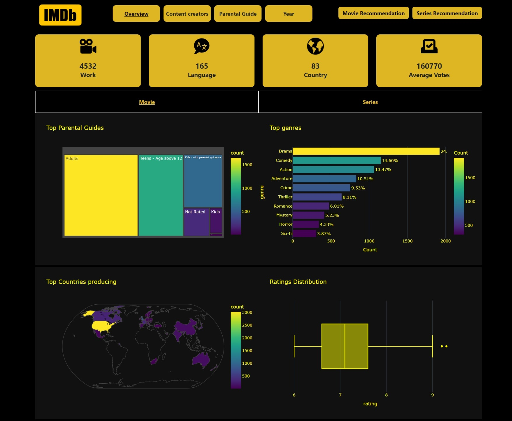

# IMDb Dashboard For Top Movies and Series

This repository contains code for an IMDb dashboard built using Dash and Plotly. The dashboard allows users to explore IMDb data, visualize trends, and get recommendations for movies and series.

## Features

- **Overview**: Provides an overview of IMDb data with various visualizations including distribution of movies by genre, ratings distribution, and more.
- **Content Creators**: Visualizes data related to content creators such as directors, writers, and stars. Users can explore which directors have produced the most highly-rated movies, or which writers are associated with popular TV series.
- **Parental Guide**: Displays information about parental guidance ratings, including distribution of ratings across movies and series.
- **Year**: Analyzes IMDb data based on release years, allowing users to see trends in movie and series production over time.
- **Recommendation System**: Offers a recommendation system for both movies and series. Users can select a movie or series from the dropdown menu, and the system will suggest similar titles based on content similarity. Recommendations are generated using a TF-IDF vectorizer and cosine similarity metric applied to textual features such as description, genre, director, and more.

## Deployment

The project is deployed and accessible at [https://imdb-dashboard.onrender.com](https://imdb-dashboard.onrender.com) or [https://mahmoud2227.pythonanywhere.com/](https://mahmoud2227.pythonanywhere.com/).

## Components

### Python Files

- **app.py**: Main file containing the Dash application layout and callbacks.
- **src**: Directory containing source code files for generating visualizations and recommendations.
- **const.py**: Module for fetching constants from the IMDb data.
- **dash1.py, dash2.py, dash3.py, dash4.py**: Modules for generating visualizations for different tabs in the dashboard.

### Data Files

- **movie_after_cleaning.csv**: Cleaned dataset containing information about movies.
- **series_after_cleaning.csv**: Cleaned dataset containing information about TV series.
- **splits_movie.xlsx**: Excel file containing additional data splits for movies.
- **splits_series.xlsx**: Excel file containing additional data splits for TV series.

### Assets

- **assets**: Directory containing image assets used in the dashboard.

## Acknowledgments

- The IMDb dataset used in this project is sourced from [IMDb Datasets](https://www.imdb.com/interfaces/).
- This project is built using [Dash](https://dash.plotly.com/) and [Plotly](https://plotly.com/python/), open-source Python libraries for creating interactive web applications and visualizations.
